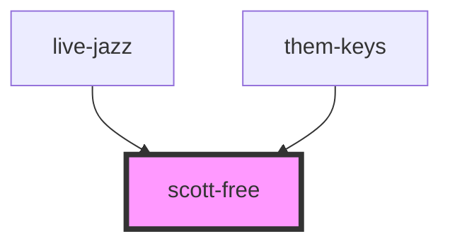

# scott-free

<!-- Auto Generated Below -->

## Properties

| Property      | Attribute | Description | Type                                           | Default          |
| ------------- | --------- | ----------- | ---------------------------------------------- | ---------------- |
| `activeNotes` | --        |             | `string[]`                                     | `[]`             |
| `octaves`     | `octaves` |             | `number`                                       | `3`              |
| `playSound`   | --        |             | `(note: string, octave: number) => () => void` | `() => () => {}` |

## Dependencies

### Used by

 - [live-jazz](../live-jazz)
 - [them-keys](../them-keys)

### Graph

----------------------------------------------

*Built with [StencilJS](https://stenciljs.com/)*
